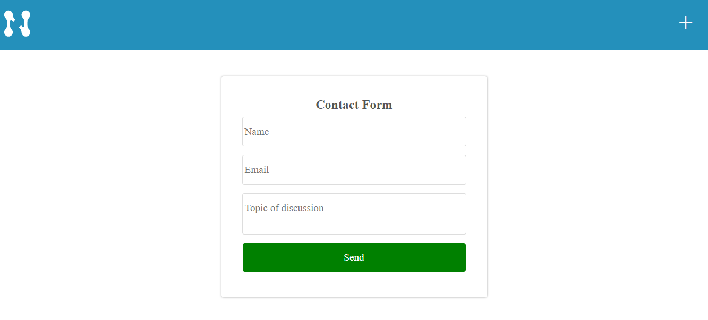
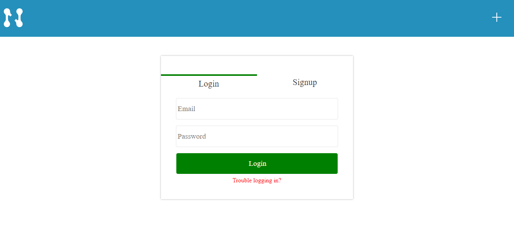
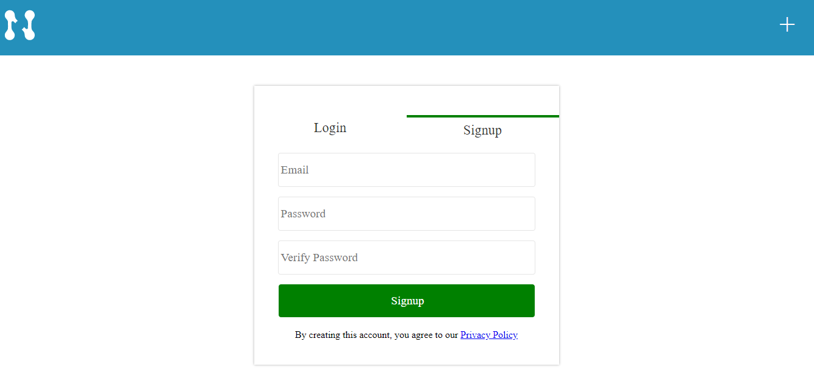
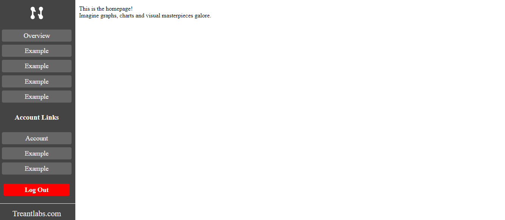

# React-With-Auth-TS Template

- [React-With-Auth-TS Template](#react-with-auth-ts-template)
  - [Summary](#summary)
  - [Key Features](#key-features)
  - [Prerequisites](#prerequisites)
  - [Screenshots](#screenshots)

<br/>

## Summary

---

The need for this template has arisen from numerous React/NodeJS projects. Rather than re-invent the wheel during each new project, this repo aims to provide a basic React boilerplate site in typescript.

This will be a mono-repo and contain files for both the client and server (NodeJS). It will utilize common packages, api endpoints and components.

Please feel free to leave comments, fork, create an issue or pull request.
<br/>

## Key Features

---

- Authentication using JWT ( JSON Web Token )
- Default site pages ( Home, About, Contact, Login, Privacy )
- React Router with layouts for front/dashboard
- Portable Code/Components
- Basic SCSS/CSS including [Normalize.css]("https://necolas.github.io/normalize.css/")
- Mobile-first Flexbox design, fully responsive
- Working Login, signup, reset, authentication workflows and input validation
- Working contact form
- Client-side dashboard
- ES7 + procedural components
  <br/>

## Prerequisites

---

Below is a list of prerequisites that should be installed/configured before cloning and starting the repo.
<br/>

**Update .env files**

- Client-side: Update .env with site name and local url
- Server-side: Rename example.env to .env and change variables as neccessary

**Note: Email functionality will not work without proper configuration. Please modify the src/config/email.js file as commented.**

<br/>

**MongoDB Installation**

See installation instructions from [MongoDB.com](https://www.mongodb.com/docs/manual/administration/install-community/)

<br/>

**Cloning and setup instructions**

On linux/Mac cd into your desired directory and run...

```
git clone https://github.com/brymed88/react-with-auth
```

Traverse into the project folder and install dependencies for the client and server code.

```
cd ./react-with-auth/client
npm install

cd ./react-with-auth/server
npm install
```

Then start the client and server side environements

```
cd ./react-with-auth/client
npm start

cd ./react-with-auth/server
npm start
```

Note: Multiple terminal windows will be neccessary to start both environments on localhost. Alternatively PM2 could be used, see [PM2](https://pm2.keymetrics.io/).  
<br/>

Status: **V1 - In-Progress**

## Screenshots

Contact Form
<br/>



Login Form
<br/>



Signup Form
<br/>



Dashboard
<br/>

